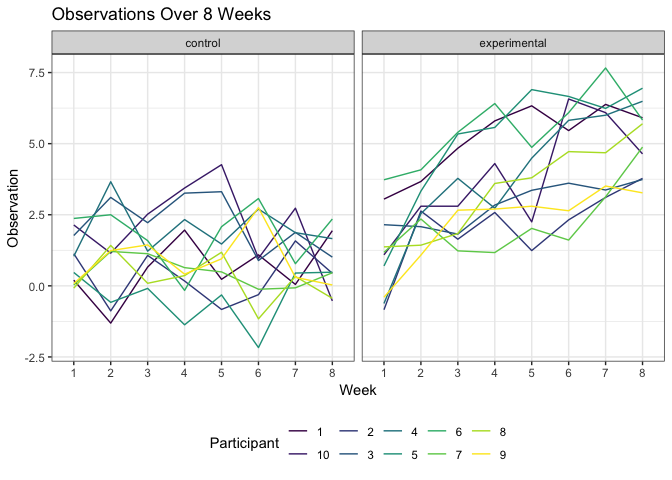

Homework 5
================
Marisa Sobel
11/5/2018

## Problem 1

Make a dataframe that contains control and experimental data from
longitudinal study. Each participant is in its own file. Want in data
frame: subject ID, arm, observations over time.

#### Data import

``` r
# dataframe containing all file names (list.files)
file_names_df = tibble(
  file_names = list.files(path = "./data/problem_1"))

# function to read csv files

read_data <- function(file_name) {
  
  read_csv(paste0("data/problem_1/", file_name))
  
}

# data frame with nested results from each file 
study_data_import = 
  file_names_df %>% 
  mutate(
    study_data = map(file_names_df$file_names, read_data))
```

#### Tidy results

``` r
# unnest, transform to long format, separate file names into study arm and subject ID
study_data_tidy = 
  study_data_import %>% 
  unnest() %>% 
  gather(key = week, value = observation, week_1:week_8) %>% 
  separate(file_names, into = c("study_arm", "subject_id"), sep = "\\_") %>% 
  mutate(
    subject_id = str_replace(subject_id, "\\.csv", ""),
    subject_id = str_remove(subject_id, "^0+"), 
    week = str_replace(week, "\\week_", "")) 

study_data_tidy
## # A tibble: 160 x 4
##    study_arm subject_id week  observation
##    <chr>     <chr>      <chr>       <dbl>
##  1 con       1          1            0.2 
##  2 con       2          1            1.13
##  3 con       3          1            1.77
##  4 con       4          1            1.04
##  5 con       5          1            0.47
##  6 con       6          1            2.37
##  7 con       7          1            0.03
##  8 con       8          1           -0.08
##  9 con       9          1            0.08
## 10 con       10         1            2.14
## # ... with 150 more rows

# version 2 - keeps study arm and subject ID together
study_data_tidy_2 = 
  study_data_import %>% 
  unnest() %>% 
  gather(key = week, value = observation, week_1:week_8) %>% 
  rename(subject_id =  file_names) %>% 
  mutate(
    subject_id = str_replace(subject_id, "\\.csv", ""),
    week = str_replace(week, "\\week_", "")) 

study_data_tidy_2
## # A tibble: 160 x 3
##    subject_id week  observation
##    <chr>      <chr>       <dbl>
##  1 con_01     1            0.2 
##  2 con_02     1            1.13
##  3 con_03     1            1.77
##  4 con_04     1            1.04
##  5 con_05     1            0.47
##  6 con_06     1            2.37
##  7 con_07     1            0.03
##  8 con_08     1           -0.08
##  9 con_09     1            0.08
## 10 con_10     1            2.14
## # ... with 150 more rows
```

#### Plot participant’s observations overtime

``` r
# spaghetti plot showing obs on each subject over time, comment on differences 
study_data_tidy_2 %>% 
  ggplot(aes(x = week, y = observation, color = subject_id, group = subject_id)) + 
  geom_line() +
  labs(
    title = "Observations Over 8 Weeks", 
    x = "Week", 
    y = "Observation", 
    color = "Participant") + 
  viridis::scale_color_viridis(discrete = TRUE)
```

<!-- -->

``` r
# could not figure out how to make plot with separate study arm and subject ID
# they seem to need to go together as one does not exist without the other
```

## Problem 2

The *Washington Post* has gathered data on homicides in 50 large U.S.
cities and made the data available through a GitHub repository
[here](https://github.com/washingtonpost/data-homicides). You can read
their accompanying article
[here](https://www.washingtonpost.com/graphics/2018/investigations/where-murders-go-unsolved/).
